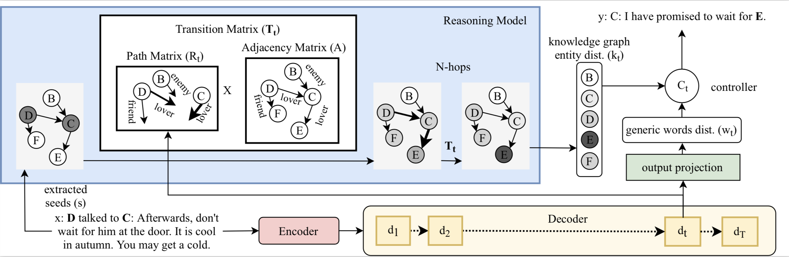

# DyKGChat
The project contains the collected data and code of our paper **Yi-Lin Tuan, Yun-Nung Chen, Hung-yi Lee. "DyKgChat: Benchmarking Dialogue Generation Grounding on Dynamic Knowledge Graphs", EMNLP 2019**.

* our proposed approach: (Qadpt) **Q**uick **Ad**a**pt**ive Dynamic Knoledge-Grounded Neural Converation Model (pronouce: Q-adapt)



## Setup
### Installation (my environment)
* python3.6
* tensorflow r1.13
* jieba
* nltk3.2.5

### Files
* `data/`: the collected data `hgzhz/` and `friends/` as well as the trained TransE
* `model_ckpts/`: the trained models in the paper


## Usage
* clone the repository
* run the script `run.sh`
```
$bash run.sh <GPU_ID> <method> <model> <data> <exp_name>
```
  * for <GPU_ID>, check your device avalibility by `nvidia-smi`
  * for <method>, choose from `train`, `pred_acc`, `eval_pred_acc`, `ifchange`
  * for <model>, choose from `seq2seq`, `MemNet`, `TAware`, `KAware`, `Qadpt`
  * for <data>, choose from `friends`, `hgzhz_v1_0`(used in our paper), `hgzhz`(current newest version)
  * for <exp_name>, check the directory `model_ckpts`

## More description
* testing method
  * `pred_acc`: for metrics `Generated-KW`, `BLEU-2`, `distinct-n`
  * `eval_pred_acc`: for metrics `KW-Acc`, `KW/Generic`, `perplexity`
  * `ifchange`: for change rates / accurate change rates
* script options
  * the `hops_num` and `change_level` are required to be changed in `run.sh`
